# Demo Apache Iceberg no Cloudera Data Services

Este repositório demonstra um cenário de **Lakehouse governamental** usando Apache Iceberg, com foco em gestão de benefícios sociais.

## O que vamos mostrar

A demo mostra como usar o Iceberg para:

- criar e carregar tabelas;
- aplicar operações transacionais como `UPDATE`, `DELETE` e `MERGE`;
- usar particionamento inteligente;
- evoluir schema com segurança;
- consultar snapshots, histórico e metadados;
- validar a mesma tabela a partir de múltiplas engines.

## Ferramentas usadas

### 1. Jupyter Notebook + Livy3

Os notebooks do repositório são usados para enviar consultas e cargas via **Spark/Iceberg** usando o serviço **Livy3**.

Esse é o caminho principal da demo para:

- criar tabelas Iceberg;
- carregar dados;
- executar DML;
- validar rollback, snapshots e manutenção.

### 2. Impala / Hive (consulta ad-hoc)

Além dos notebooks, usamos **Impala** e **Hive** como camada de consulta para explorar e validar o que foi criado.

Essa etapa é útil para:

- consultar tabelas já carregadas;
- validar o consumo multi-engine;
- analisar dados e metadados;
- fazer consultas ad-hoc sem depender do fluxo principal do notebook.

## Estrutura da demo

- Os notebooks em Python executam o fluxo principal de Spark/Iceberg via Livy3.
- Os arquivos `.md` em `Impala_e_HUE/` e na raiz complementam a demo com consultas e validações usando Impala/Hive.

## Primeiros passos no Cloudera Data Services - CAI

### Login
Pegue o link que o instrutor passou para vocês para realizar o login na plataforma, assim como o usuário e senha de cada um.
`user<xxx>` 
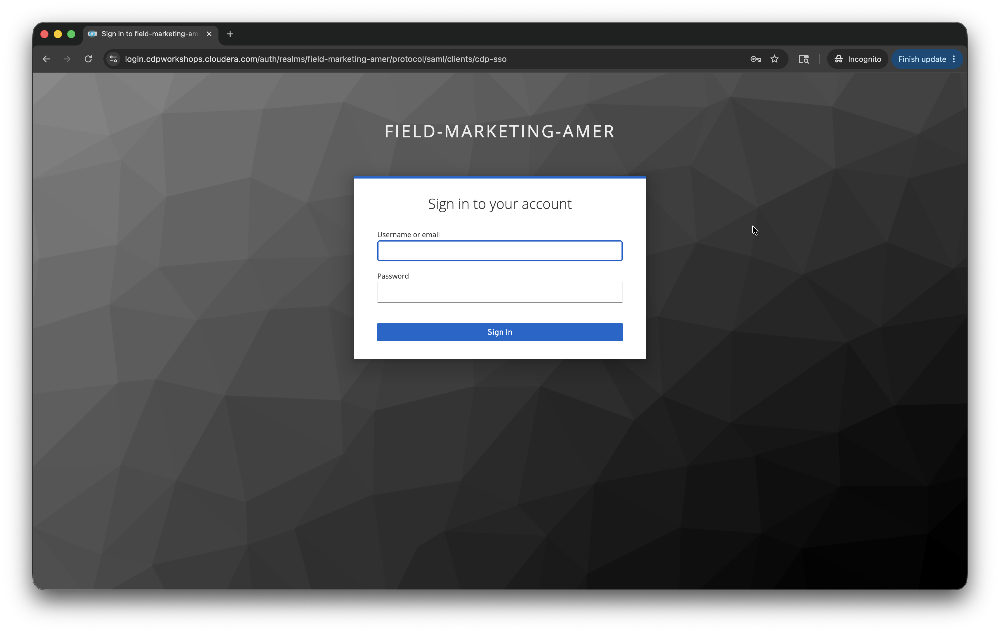

Após realizar o login uma tela deve aparecer com todos os serviços do Cloudera Data Services:
Procure por *Cloudera AI*
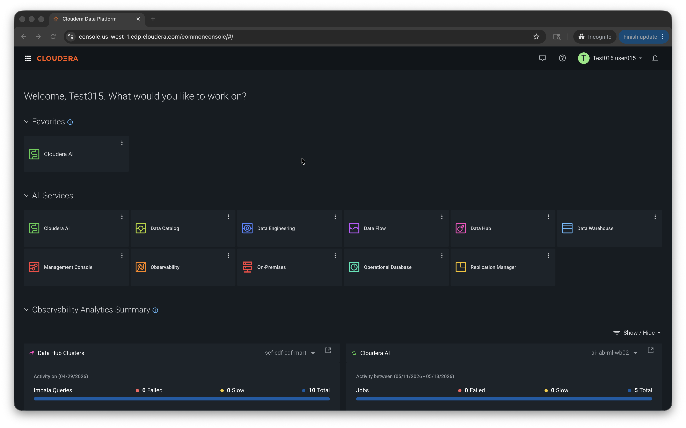

Já em Cloudera AI você deverá ver a tela de home da plataforma:
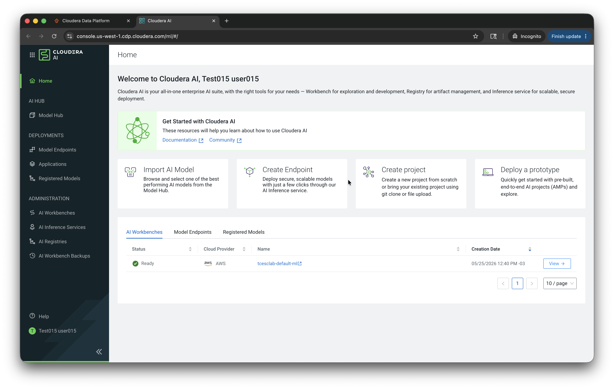
- Verificar Modelos da NVidia (IA Generativa)
- Registar modelos de IA Generativa em endpoints
- Podemos gerenciar aplicações
- Registrar e gerenciar modelos NVidia e externos (IA Generativa)
- Criar Workbenchs por times ou projetos
- Criar, gerenciar e configurar o serviço de Inferência
- Criar backups de Workbenchs

Agora acesse o workbench que está disponível para você:
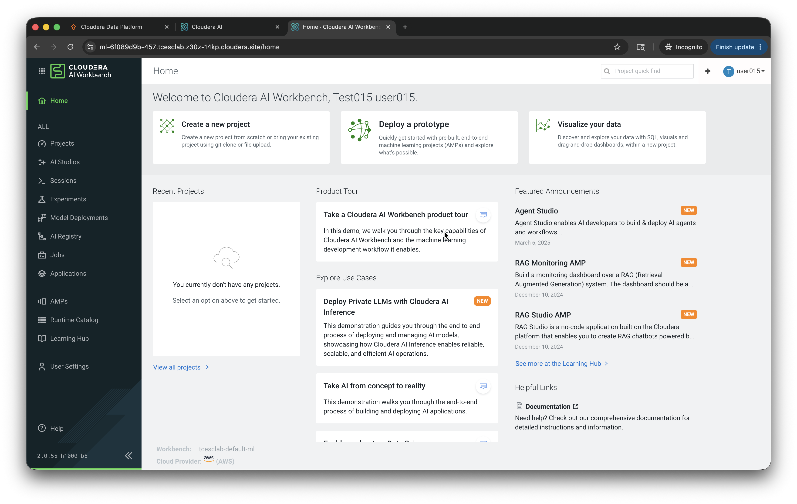

**Já estamos prontos para começar nosso projeto!!**

### Clonando Template/Projeto para Workbench

Procure por "Create a new project"
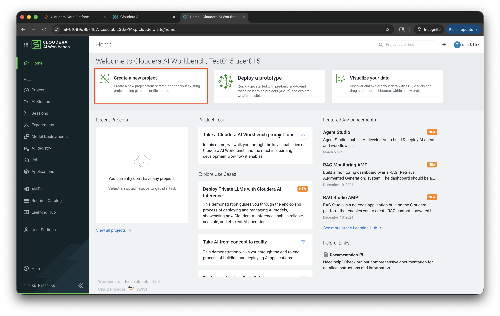

Agora configure o novo projeto, vamos utilizar nosso projeto no github como referência:
Project Name: `HOL Solr`
Project Description: `Utilização de Solar para Index de documentos`
GitHub: `https://github.com/vitorconde/HOL_SOLR`
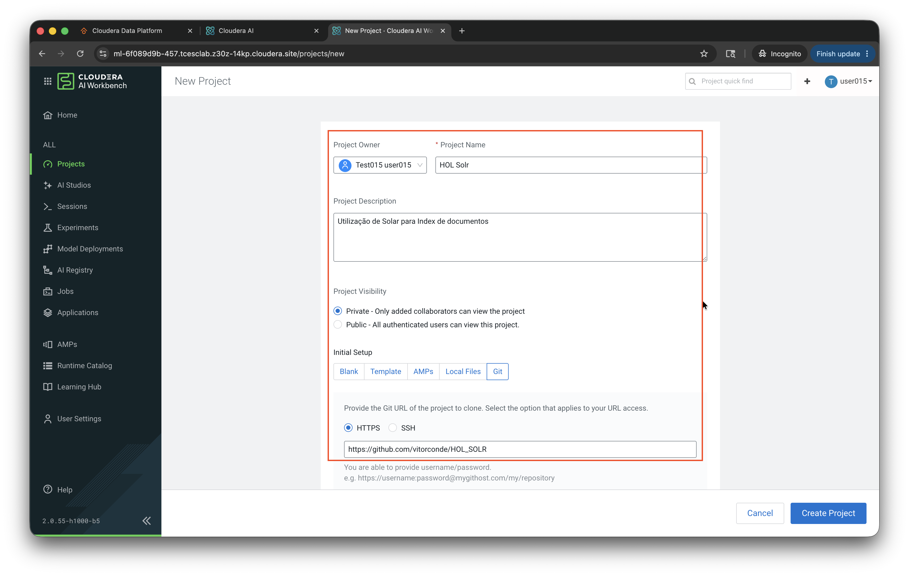

Como não utilizaremos GPU, vamos deixar nossa escolha de IDE mais direcionada para nosso projeto.
*Podemos clicar em Create Project assim que terminado de configurar*
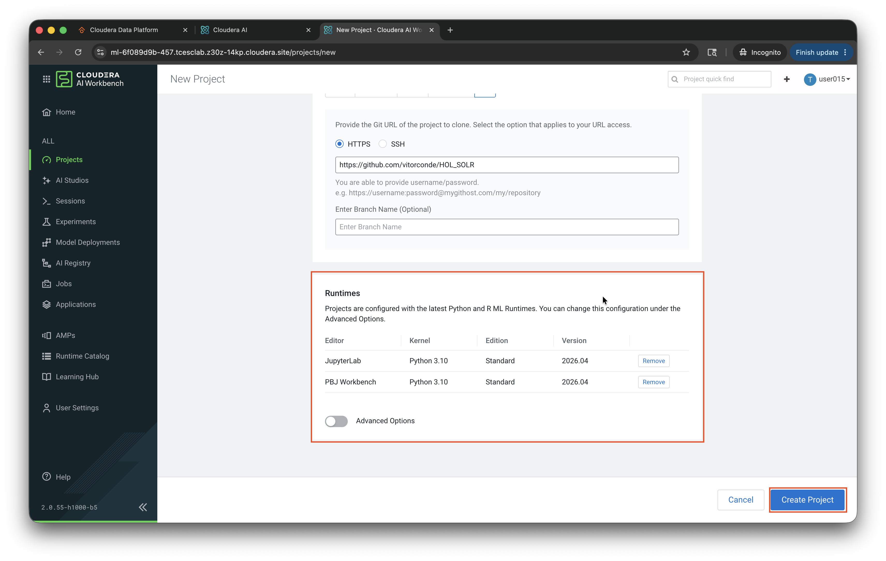

Depois de criar o projeto, você poderá ver as pastas e arquivos deste repositório que foi clonado diretamente do github.
*Clique em Files*
*Podemos então avançar para criar uma sessão de processamento para nosso projeto - Clique em New Session*
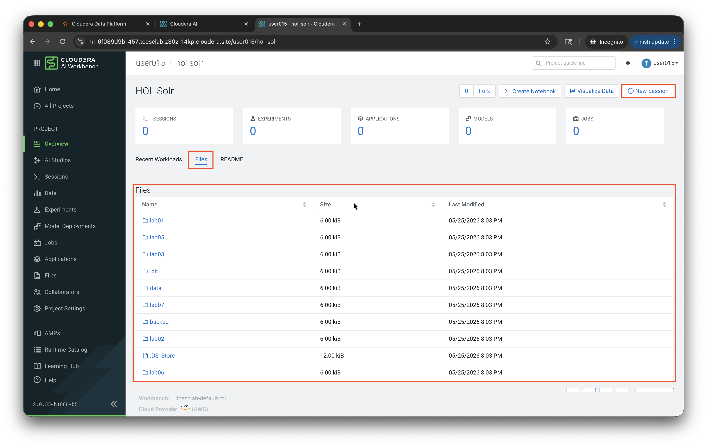

Session Name: `sess-user<xxx>`
*Selecione JupyterLab*
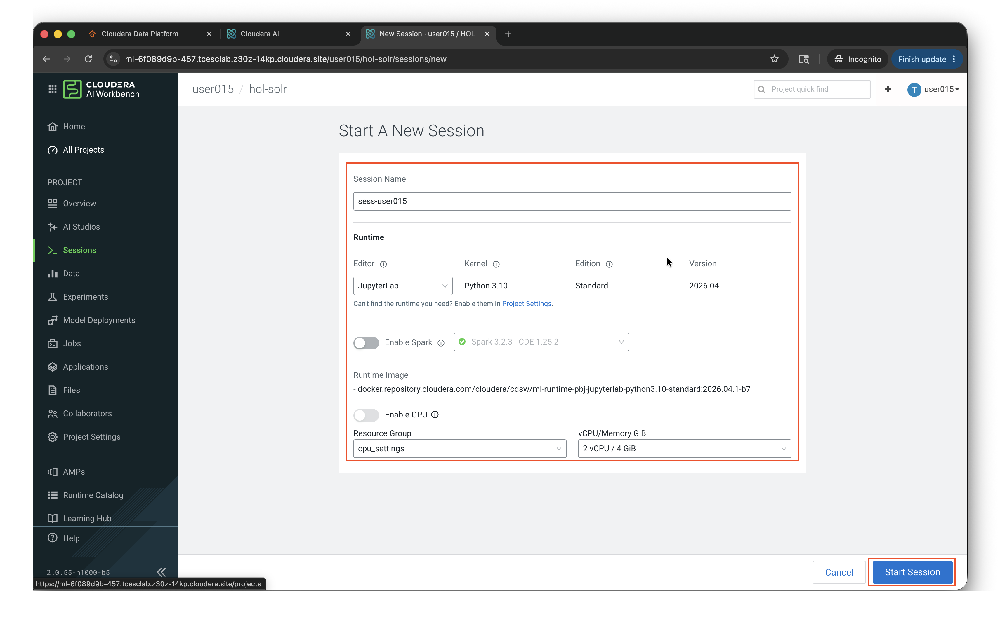

Tela de carregamento do POD para sua sessão:
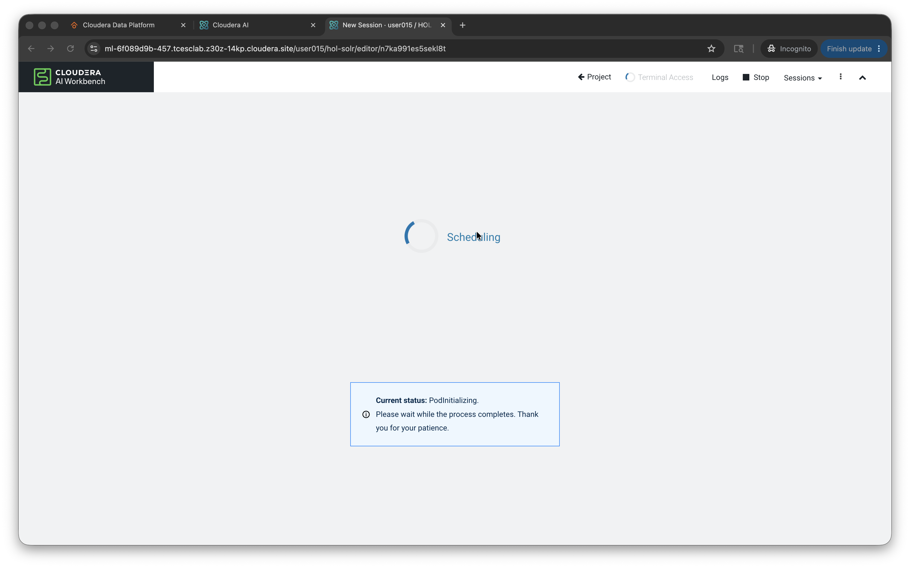

Após carregar, você verá uma tela assim:
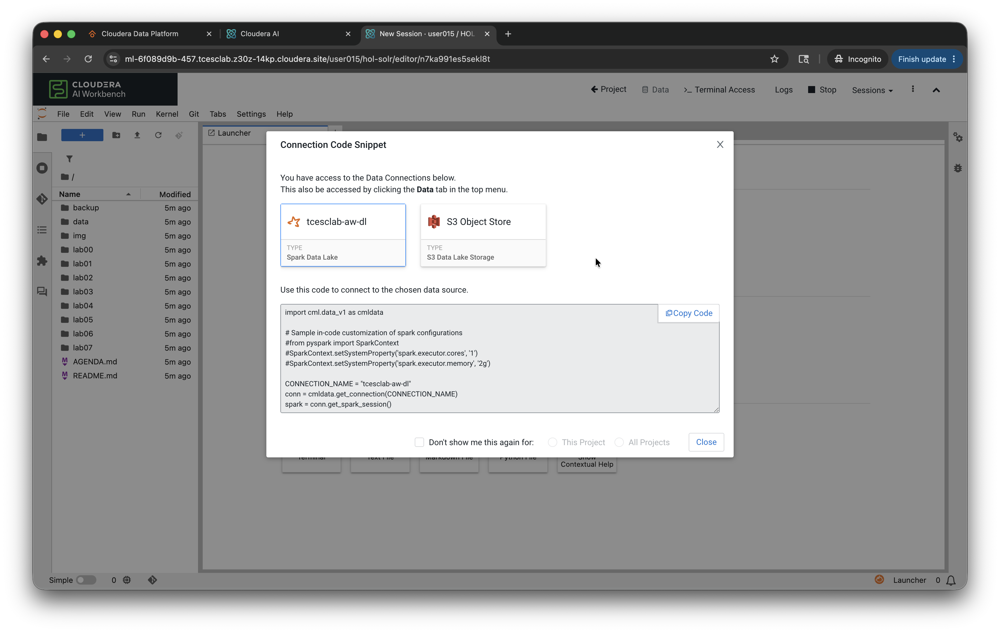
*Pode clicar em Close ou no x*

Então você poderá iniciar os labs, todos os arquivos e pastas devem estar na aba ao lado esquerdo.
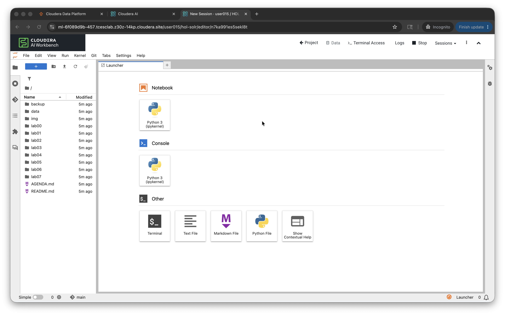

Boa jornada!

## Banco e tabelas usadas

A demo trabalha com o banco `governo_mg`, incluindo tabelas como:

- `governo_mg.beneficios_<usuario>`
- `governo_mg.beneficios_particionados_<usuario>`
- `governo_mg.beneficios_staging_<usuario>`
- `governo_mg.beneficios_csv_<usuario>`

## Observação importante para Impala/Hive

Depois de cargas realizadas pelos notebooks, é comum executar `INVALIDATE METADATA` nas tabelas para garantir que o Impala veja as mudanças mais recentes.

Exemplo:

```sql
INVALIDATE METADATA governo_mg.beneficios_<usuario>;
INVALIDATE METADATA governo_mg.beneficios_particionados_<usuario>;
INVALIDATE METADATA governo_mg.beneficios_staging_<usuario>;
INVALIDATE METADATA governo_mg.beneficios_csv_<usuario>;
```

## Sequência sugerida

1. Execute os notebooks principais com Spark/Iceberg via Livy3.
2. Valide o resultado com as consultas em Impala/Hive.
3. Explore os exemplos de auditoria, snapshots, time travel e governança.

## Arquivos de apoio

- `01_validacao_tabelas_impala.md`
- `02_consulta_beneficios.md`
- `03_particionamento_oculto.md`
- `04_analytics_beneficios_sociais.md`
- `05_metadata_tables.md`
- `06_snapshots_history_time_travel.md`
- `07_auditoria_operacional.md`
- `08_validacao_merge_incremental.md`
- `09_consulta_csv_carregado.md`
- `10_governanca_e_consumo_bi.md`
- `11_dml_impala_opcional.md`

## Dica prática

O notebook é o caminho de **escrita e processamento** da demo. O Impala/Hive é o caminho de **consulta, validação e análise ad-hoc**.
